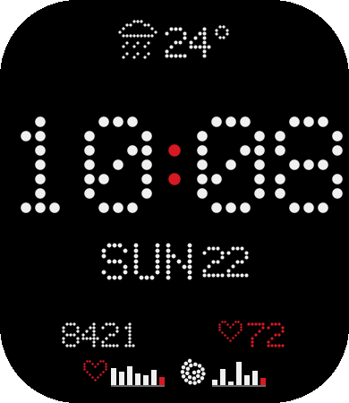
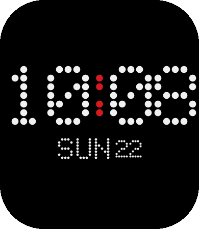

# Dots — Nothing-style watch face for Amazfit Bip 6

A minimal dot-matrix watch face for the **Amazfit Bip 6** (Zepp OS 5.0). Black
screen, white dots, a single red accent — inspired by Nothing's aesthetic.
Time in dots, **no hands, no seconds**. English only. Energy-conscious.

 

## What's on screen

- **Big HH:MM** in a dot-matrix font (red colon). OS-driven — updates without
  waking the JS runtime.
- **Date** — weekday · day · month (`SUN 22 JUN`).
- **Weather** (top) — a dotted condition icon, the day's high temperature, and a
  red **rain drop** that appears only when rain is expected.
- **Metrics** — steps (foot icon) and heart rate (red heart). Symbols, not labels.
- **Two weekly mini bar graphs** (bottom) — resting heart rate (❤) and an
  HRV-proxy (△); today's bar is red.
- **AOD** — the same look, time + date only, on true black (minimal lit pixels).

## Quick start

```bash
npm install                 # dev tooling (asset generator)
npm run assets              # generate dot-matrix PNGs + assets.gen.js
npm run preview:local       # open preview/watchface-preview.html in a browser
npm run build               # -> dist/*.zab  (uses the global Zeus CLI)
```

Install the Zeus CLI once: `npm i -g @zeppos/zeus-cli` (Node 18–24).

## Build & put it on the watch (TL;DR)

```bash
npm i -g @zeppos/zeus-cli          # once
npm install && npm run build       # -> dist/<id>-Dots-<ver>.zab
zeus login                         # your Zepp account
zeus preview                       # prints a QR code in the terminal
```

Then on the phone: **Zepp app → Profile → Settings → About → tap the Zepp logo
7×** to enable Developer Mode, tap **Scan**, and scan the QR — it installs to the
paired Bip 6 over Bluetooth. Full details (simulator, bridge) in
[`docs/INSTALL.md`](docs/INSTALL.md).

## Local preview (no watch, no simulator)

`npm run preview:local` builds a self-contained HTML page from the **same**
generated PNGs and the **same** `layout.js` the device uses, so it is
pixel-exact. It has a live clock, sample metrics/weather, and an **AOD toggle**.

## Honest data notes

- **HRV is not available** to any Zepp OS watch face (no sensor API). The second
  graph shows **Stress**, which Zepp derives from HRV, as the closest proxy.
- **Weekly history** for resting HR / stress is **not exposed** either — the face
  samples one value per day and stores it itself, so the graphs fill in over a week.
- **Weather** uses the built-in, phone-synced sensor. Watch faces have **no
  network**, so a custom provider (e.g. Yandex) is not possible from a face.

See [`docs/DATA-AND-LIMITATIONS.md`](docs/DATA-AND-LIMITATIONS.md) for the why.

## Docs

- [`docs/ARCHITECTURE.md`](docs/ARCHITECTURE.md) — how the project is wired.
- [`docs/DATA-AND-LIMITATIONS.md`](docs/DATA-AND-LIMITATIONS.md) — sensors, weather, energy.
- [`docs/INSTALL.md`](docs/INSTALL.md) — build, simulator, on-watch install.

## License

MIT
