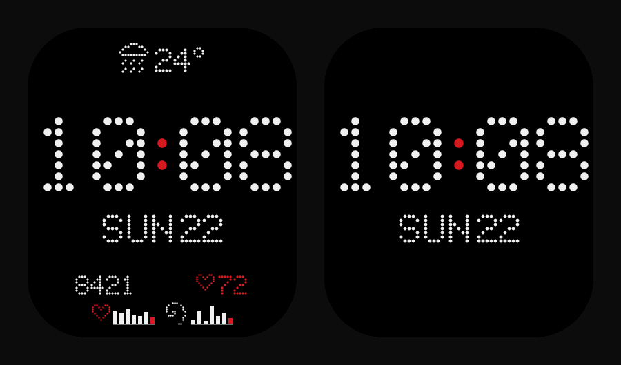

# Dots — Nothing-style watch face for Amazfit Bip 6

A minimal dot-matrix watch face for the **Amazfit Bip 6**. Black screen, white
dots, a single red accent — inspired by Nothing's aesthetic. Time in dots,
**no hands, no seconds**. English only. Energy-conscious.



> ⚠️ Built entirely by Claude (Anthropic's Claude Code). The human operator never
> read the code — every change to the project files was made by the model, then
> compiled and flashed. Treat it accordingly.

## What's on screen

- **Big HH:MM** in a dot-matrix font, edge to edge, with a red colon.
- **Date** — weekday and day (e.g. `SUN 22`), one consistent font.
- **Weather** (top) — a dotted condition icon and the day's temperature.
- **Steps** and **heart rate** (red heart), shown small as symbols + numbers.
- **Two weekly mini bar graphs** (bottom) with dotted icons; today's bar is red.
- **Always-On Display** — the same look, time + date only, on true black.

## Build & put it on the watch

```bash
npm i -g @zeppos/zeus-cli          # the official Zepp OS tool, once
npm install && npm run build       # -> dist/*.zab
zeus login                         # your Zepp account
zeus preview                       # prints a QR code in the terminal
```

On the phone: **Zepp app → Profile → Settings → About → tap the Zepp logo 7×**
to enable Developer Mode, tap **Scan**, and scan the QR — it installs to the
paired Bip 6. More detail in [`docs/INSTALL.md`](docs/INSTALL.md).

## Local preview (no watch, no simulator)

```bash
npm run preview:local      # opens nothing; then open the file below
```

Open `preview/watchface-preview.html` in any browser — a pixel-exact mock with a
live clock, sample metrics, and an **AOD toggle**.

## Notes on the data

Some things the watch simply doesn't share with a watch face:

- **HRV** isn't available, so the second graph shows a **variability proxy**
  derived from heart rate instead.
- **Weekly history** isn't provided either — the graphs **fill in over a week**
  as the watch is worn (a fresh install shows only today).
- **Weather** comes from the phone (synced by the Zepp app); a custom provider
  can't be used from a watch face.

See [`docs/DATA-AND-LIMITATIONS.md`](docs/DATA-AND-LIMITATIONS.md) for the why.

## Docs

- [`docs/ARCHITECTURE.md`](docs/ARCHITECTURE.md) — how the project is organized.
- [`docs/DATA-AND-LIMITATIONS.md`](docs/DATA-AND-LIMITATIONS.md) — what's shown and what isn't.
- [`docs/INSTALL.md`](docs/INSTALL.md) — build, preview, install.

## License

MIT
